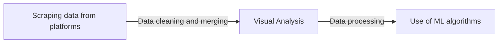

CURRENTLY IN BUILD
# Food Delivery Apps Reviews - Revisit

This project is second version of  Food Delivery Apps Reviews analysis, corrected, with better more readable visualizations. The main goal was to apply the new knowledge acquired over the course of the semester of study.

The analysis presents a breakdown of the statistics behind food ordering apps. Which app has the most reviews? How did the average grades change over the years? Which app is the best rated? The answers to these questions are included in the above analysis.


## Apps

Projects contains reviews from apps:

- **Uber Eats**
- **Glovo**
- **Grubhub**
- **Wolt**
- **Bolt Food**

scraped from Apple App Store and Google Play Store.

## Process



## Used technologies
- NLTK for data manipulation and processing
- BERT for prediction of score of reviews
- Azure Language Service for prediction of score of reviews

## Installation
If you want to try this projects, use pip manager to install libraries.
```bash
python -m nltk.downloader all
pip install torch numpy pandas scikit-learn seaborn wordcloud
```
For azure downloads, check out https://learn.microsoft.com/en-us/azure/ai-services/language-service/sentiment-opinion-mining/overview?tabs=prebuilt

## Authors
- Maksymilian Norkiewicz
- Jędrzej Ogrodowski

from the Faculty of Computing and Telecommunications, Poznan's University of Technology.
